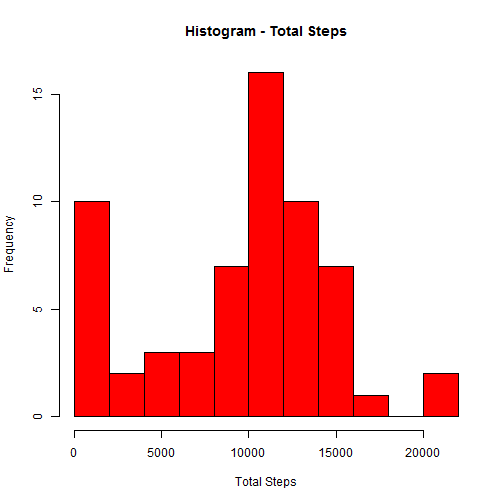
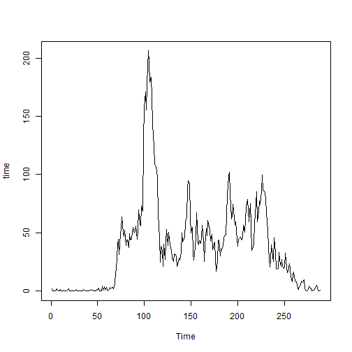
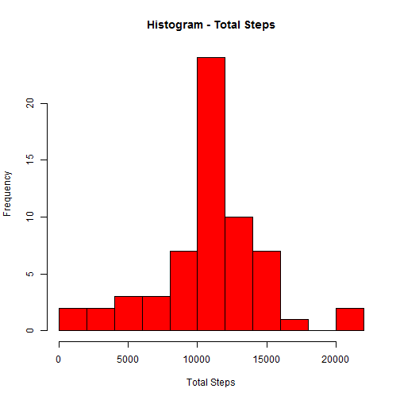
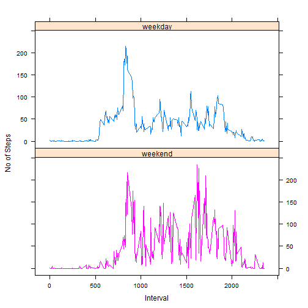

**Objective** - To load, clean, analyze and represent 2 month (Oct-Nov 2012) fitness data collected at 5 minute intervals for an anonymous individual


```r
setwd("E:/3_DATA SCIENCE SPECIALISATION/5_Reproducible Research Dec15/Week02/Peer Assignment-1")
```


```r
data <- read.csv("./activity.csv", sep = ",",colClasses = c("numeric","Date","numeric"),stringsAsFactors = F, na.strings = c("NA",""))
data$SrNo <- as.character(seq(1,nrow(data)))
```


```r
#install.packages("dplyr") - To install dplyr if not already installed
library(dplyr, warn.conflicts = F)

# (1) Date-wise sum of total steps taken
dt_grp <- dplyr::group_by(data,date)
t_steps <- summarise(dt_grp, tot_steps = sum(steps, na.rm = T))

# (2) Histogram of total steps
t_steps <- as.data.frame(t_steps)
hist_steps <- hist(t_steps$tot_steps,breaks =15 ,col = "Red", main = "Histogram - Total Steps", xlab = "Total Steps")
```

 

```r
# (3) Mean and Median Steps per day
mean_steps <- mean(t_steps$tot_steps , na.rm = T)
mean_steps
```

```
## [1] 9354.23
```

```r
median_steps <- median(t_steps$tot_steps , na.rm = T)
median_steps
```

```
## [1] 10395
```


```r
int_grp <- group_by(data,interval)
avg_steps <- as.data.frame(summarise(int_grp, avg_steps = mean(steps, na.rm = T)))

# Converting interval level avg steps to a time-series
time <- ts(data = avg_steps$avg_steps)

# (1) Plotting time-series data
plot(time, type = "l")
```

 

```r
# (2) 5 minute interval with max number of average steps
avg_steps[avg_steps$avg_steps == max(avg_steps$avg_steps),"interval"]
```

```
## [1] 835
```


```r
# (1) No of rows with NAs
data$cmp <- complete.cases(data)
length(data[data$cmp == F,"SrNo"])
```

```
## [1] 2304
```

```r
# (2) Missing Value Replacement
## To be done by replacing the missing ones with average steps in that 5 min interval
clean_data <- merge(data,avg_steps, by.x = "interval", by.y = "interval", all.x = T)
clean_data$steps_cleaned <- ifelse(is.na(clean_data$steps),clean_data$avg_steps,clean_data$steps)

# (3) New dataset with missing data filled
clean_data <- clean_data[,c("steps_cleaned","date","interval")]
names(clean_data)[1] <- "steps"
```


```r
# (1) Date-wise sum of total steps taken
cdt_grp <- dplyr::group_by(clean_data,date)
t_csteps <- summarise(cdt_grp, tot_csteps = sum(steps, na.rm = T))

# (2) Histogram of total steps
t_csteps <- as.data.frame(t_csteps)
hist_csteps <- hist(t_csteps$tot_csteps,breaks =15 ,col = "Red", main = "Histogram - Total Steps", xlab = "Total Steps")
```

 

```r
# (3) Mean and Median Steps per day
mean_csteps <- mean(t_csteps$tot_csteps , na.rm = T)
mean_csteps
```

```
## [1] 10766.19
```

```r
median_csteps <- median(t_csteps$tot_csteps , na.rm = T)
median_csteps
```

```
## [1] 10766.19
```

**Observations**

- *The mean and median of the data are now the same.*


```r
## (1) Factor variable with 2 levels "Weekday" and "Weekend"
clean_data$dow <- as.factor(ifelse(weekdays(clean_data$date, abbreviate = T) == c("Sat","Sun") , "weekend", "weekday"))
```


```r
## (2) For Panel Plot
wkdy_int_grp <- group_by(clean_data[clean_data$dow == "weekday",],interval)
wkdy_avg_steps <- as.data.frame(summarise(wkdy_int_grp, avg_steps = mean(steps, na.rm = T)))

wknd_int_grp <- group_by(clean_data[clean_data$dow == "weekend",],interval)
wknd_avg_steps <- as.data.frame(summarise(wknd_int_grp, avg_steps = mean(steps, na.rm = T)))

dow_analysis <- merge(wkdy_avg_steps,wknd_avg_steps, by.x = "interval" , by.y = "interval")
names(dow_analysis)[2:3] <- c("wkdy_avg_steps","wknd_avg_steps")

#install.packages("lattice")
library(lattice)

dow_analysis$wktag <- "weekday"
dow_analysis$wktag1 <- "weekend"

dow_plot <- dow_analysis[,c("interval","wkdy_avg_steps")]
names(dow_plot)[2] <- "steps"
dow_plot$wktag <- "weekday"

temp <- dow_analysis[,c("interval","wknd_avg_steps")]
names(temp)[2] <- "steps"
temp$wktag <- "weekend"

dow_plot <- rbind(dow_plot,temp)

xyplot(steps~interval|wktag, groups = wktag,data = dow_plot,type = "l",layout = c(1,2),as.table =T,xlab = "Interval", ylab = "No of Steps")
```

 
